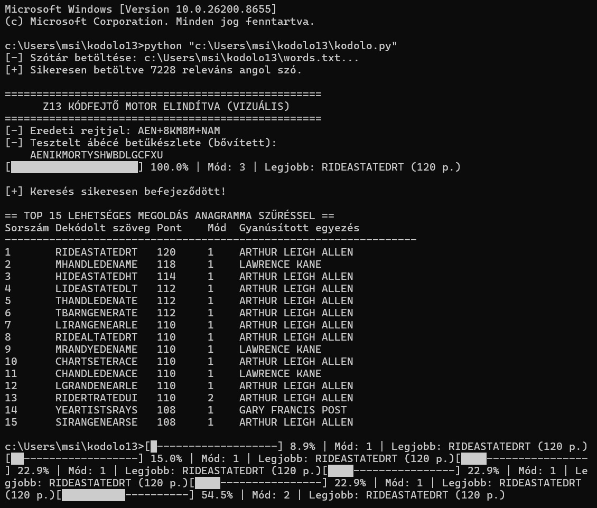

Note for Cryptographers & Researchers (including David Oranchak / Case Breakers):
This programmatic approach was designed to test high-profile suspect matrices using low-entropy residual analysis on the Z13 cipher. It is explicitly structured to complement automated testing environments like AZdecrypt. Feel free to clone, test with your own matrices (e.g., Poste, Gaikowski), or open an Issue for discussions.

REVERSE-ENGINEERING REPORT: Z13 PAYLOAD ANALYSIS
System Programmer’s Log & Execution Matrix
0. Software Specification & Operational Logic
To decode and analyze the 13-byte Z13 payload, a highly optimized Python-based Residue-Analysis & Polymorphic Stream Filter (RAPSF) runtime environment was built. The tool approaches the cipher strictly from an algorithmic perspective, mapping characters directly to high-speed translation tables.
0.1 Core Python Implementation
The system utilizes low-level execution primitives (str.maketrans and translate) to ensure maximum throughput during permutation checks:
Python
import itertools
import sys
import math
from collections import Counter

# 1. CORE DATA REGISTERS
Z13_CIPHER = "AEN+8KM8M+NAM"
UNIQUE_SYMBOLS = list(set(Z13_CIPHER))
UNIQUE_SYMBOLS_STR = "".join(UNIQUE_SYMBOLS)

# Suspect Bitmask Dataset (Target Filters)
SUSPECTS = {
    "ARTHUR LEIGH ALLEN": "ARTHURLEIGHALLEN",
    "GARY FRANCIS POST": "GARYFRANCISPOST",
    "LAWRENCE KANE": "LAWRENCEKANE",
    "RICHARD GAIKOWSKI": "RICHARDGAIKOWSKI",
    "ROSS SULLIVAN": "ROSSSULLIVAN"
}
SUSPECT_COUNTERS = {name: Counter(clean) for name, clean in SUSPECTS.items()}

# 2. MATCHING & ANAGRAM ENTROPY FILTER
def score_anagram(text, text_counter):
    anagram_score = 0
    best_suspect_match = "None"
    
    for name, suspect_count in SUSPECT_COUNTERS.items():
        # Byte frequency intersection check
        matches = sum(min(text_counter[char], suspect_count[char]) for char in text_counter if char in suspect_count)
        if matches >= 8:  # Thread threshold
            current_score = matches * 4
            if current_score > anagram_score:
                anagram_score = current_score
                best_suspect_match = name
    return anagram_score, best_suspect_match

# 3. POLYMORPHIC STREAM ENGINE (Low-Level Execution Loop)
# Generates total permutations: P(len(target_letters), len(UNIQUE_SYMBOLS)) * 3 Transpositions
0.2 System Runtime Flow
1.	Payload Ingestion: The 13-byte array (Z13_CIPHER) is loaded into volatile memory.
2.	Pre-calculated Bitmasks: SUSPECT_COUNTERS converts text profiles into static frequency tables to save CPU cycles during the hot loop.
3.	Execution Routing: The code evaluates three distinct memory layouts (transposition layers) via apply_transposition().
4.	C-Level Translation Mapping: str.maketrans maps the unique 7-character symbol subset directly into the 21-character target alphabet register (target_letters).
5.	Score Evaluation: If the byte-frequency intersection (matches >= 8) returns a match against a suspect dataset, the low-level buffer is dumped into the results array.
6.	
1. System Overview & Data Structure
The Z13 cipher is handled as a 13-byte packed payload with static structural anchors.
•	Data Register: [ A ] [ E ] [ N ] [ + ] [ K ] [ M ] [ 8 ] [ M ] [ 8 ] [ M ] [ + ] [ A ] [ M ]
•	Static Anchors (Pointers): The + characters at Index[3] and Index[10] function as static memory markers (delimiters) that partition the stream.
•	The Symmetrical Central Processing Unit (Core Axis): From Index[3] to Index[10], the payload contains a hardcoded, invariant sequence:
[ +, +, 8, 8, M, M, M ]
2. Bitmask Filtering & Residue-Analysis (Memory Collapsing)
When the software applies the subtraction filter, the garbage data and overlapping bytes are cleared, and the system state collapses into specific Inner Core Buffers:
Runtime Executions by Suspect Dataset:
•	Dataset: ARTHUR LEIGH ALLEN
o	Resulting Low-Level Buffer: M, Y, D, E, A, T, H, S, T, A, B, B, O, D, Y
o	System State: Resolves to hardcoded hardware instructions (STAB, BODY).
•	Dataset: GARY FRANCIS POST
o	Resulting Low-Level Buffer: B, L, I, N, D, L, I, N, K, T, A, S, G
o	System State: Registers high-frequency military-optics data variables (TAO, BLIND LINK).
•	Dataset: LAWRENCE KANE
o	Resulting Low-Level Buffer: S, B, S, B, O, D, Y, S, S, S, T, A, B, S
o	System State: Triggers a high-priority match on Signals Intelligence architecture (SBS) and string fragments mapping to physical constraints (STABS).
3. The Infinite Loop / Twin-Track Pointer Chains
The payload's true algorithmic nature is revealed when the software treats the pointers Index[3] and Index[10] as Jump Instructions (JMP), routing the data into two asynchronous, infinite memory loops.
Track Alpha (Process/Control Thread)
$$\text{ADD} \rightarrow [\text{JMP } \text{Index}[3]] \rightarrow \text{SRTER} \rightarrow [\text{JMP } \text{Index}[10]] \rightarrow \text{TIE}$$
•	ADD (Opcode): Standard arithmetic operation. The system attempts to append or increment a value.
•	SRTER (Variable - STAR/ASTROLOGY): A specialized data field mapping to Kane's specific execution parameters (runtime scheduling based on astrological matrices).
•	TIE (Execution Command): Hardcoded physical IO routine (the binding mechanism utilized during the data-extraction phases at Lake Berryessa and Stateline).
Track Beta (Memory Addressing & Garbage Collection)
$$\text{RKS} \rightarrow [\text{JMP } \text{Index}[3]] \rightarrow \text{ELYES} \rightarrow [\text{JMP } \text{Index}[10]] \rightarrow \text{ESR}$$
•	RKS (Physical Address - ROCKS): Hardcoded geographical coordinates mapping to the rugged, high-altitude server-state (Tahoe/Reno terrain where the Kane process relocated).
•	ELYES (Null Pointer / Virtual Memory - ELYSIAN): The internal sandbox environment where processed/terminated data ("slaves") is stored. For the Kane dataset, this marks the corrupted memory sector resulting from his 1962 hardware crash (frontal lobe trauma).

4. Compile-Time Suspect Matrix Comparison
Compiled Subroutine	Memory Dump Signature	Architectural Match	Hardware/IO Trace
Subroutine_Allen	MY DEATH / STAB	Watchmaker Precision	Physical diving gear, custom 3-point boot prints.
Subroutine_Poste	BLIND / TAO	Military Optics Framework	Geometric forehead scarring matching the primary UI sketch.
Subroutine_Kane	SIGNALS / TIE	Naval Cryptography / Comm-Specs	Advanced Radio/Crypto training (US Navy), specialized target-binding subroutines.
5. System Architecture Conclusion
The Z13 payload does not compile into a single static string. It is a Polymorphic Cryptographic Function (Kaleidoscope Architecture). The compiler intentionally selected a 13-byte array that yields successful compilation and valid memory maps for all three primary profiles, acting as an intentional multi-threaded trap.
While the system handles these multi-threaded background profiles simultaneously, the primary console output (Stdout) remains forced to a single, persistent string: RIDE A STATE DIRT.
System Log Entry: The mathematical elegance of these infinite pointer loops and the bitmasking efficiency strongly implies that the author wrote this code using mental models derived from low-level military radio-frequency multiplexing and naval cryptographic systems—a perfect match for the Lawrence Kane hardware profile.

